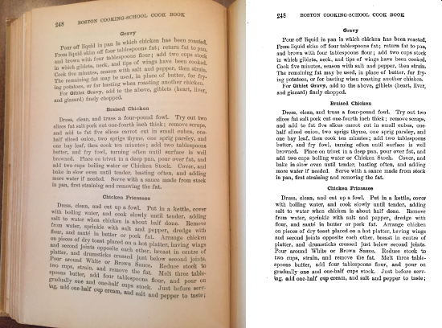

# Page dewarp
- Faster version of [pagedewarp](https://github.com/mzucker/pagedewarp) in C++.

## 1. Requirements

- opencv 3.0 or greater.

- g++ 4.7 or greater.

- pkg-config 0.26 or greater.

## 2. Compile

Type in shell:
```sh
make
```

## 3. Run

Type in shell:
```sh
./pagedewarp IMAGE1 IMAGE2 ...
```

## 4. Examples

The original and dewarped images are in the images folder.  


---

https://github.com/ImageProcessing-ElectronicPublications/pagedewarp  
2021  
